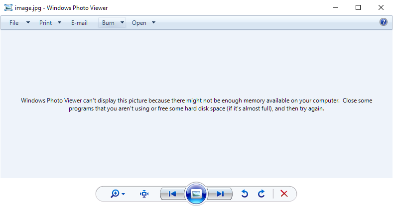

# Fix Windows Photo Viewer can't open JPG
Here is how to fix the Windows Photo Viewer problem.
 ## Where/How this problem occur?
  - Actually, idk whether Windows Photo Viewer does **not support** or **ignore ICC profiles**.
  - When open the file **using Windows Photo Viewer** this **error appeared** on Windows Photo Viewer display:
    > "Windows Photo Viewer can't display this picture because there might not be enough memory available in your computer. Close some program that you aren't using or free some hard disk space (if it's almost full), and then try again."
    
 ## How to fix
  - Somehow this can be fix by converting all your picture with **image converter** but it may resulting **quality drop**
  - To overcome the issue, only **1 byte** in the JPG file that need to be change, which is:
    > from: "ICC_PROFILE"\
    > to: "ICC_PROFILX"

    Hex view:
    > address: [not fixed]\
    > from: 0x45\
    > to: 0x58
  - It's hard to convert all of it one-by-one. So, I made a software that can change all of that **easily, simply at high speed**.
  - Refer download below

# Download
  [Download FixJPG here](https://github.com/Zigatronz/Fix-Windows-Photo-Viewer-can-t-open-JPG/releases/tag/v1.3)

# How to use
 - Simply **run** `FixJPG.exe`
 - **Drag and Drop** all **files** and **folders** contain **JPG files** to `FixJPG`'s window, then click **Scan**
 - Wait for **scanning JPG files**, all files that **need to be process** will be **list**
 - **Check All** and **Start**
 - When it's done, **summary will pop-up**
 - You're done

 # How it's work
 - Search for `ICC_PROFILE` in `.jpg` or `.jpeg` files inside `path list` recursively, list it
 - Wait for user conformation
 - Replace all `ICC_PROFILE` to `ICC_PROFILX` by writing **only 1 byte** at each file